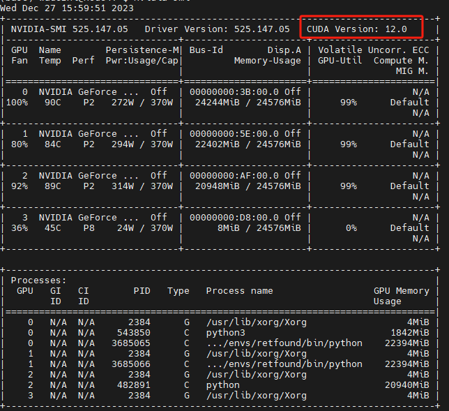
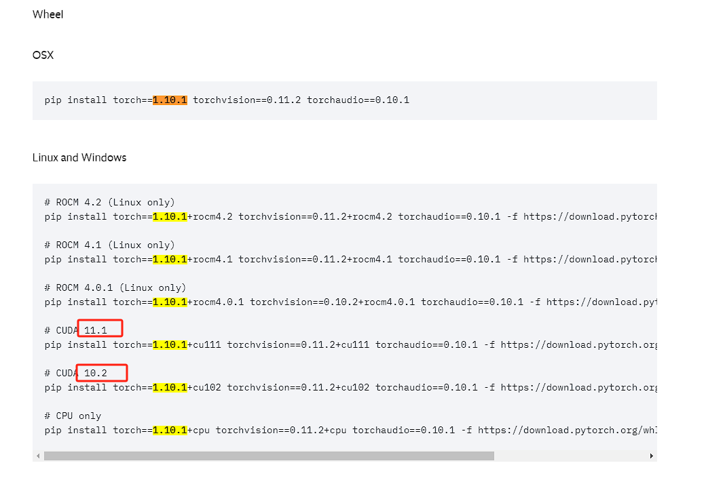
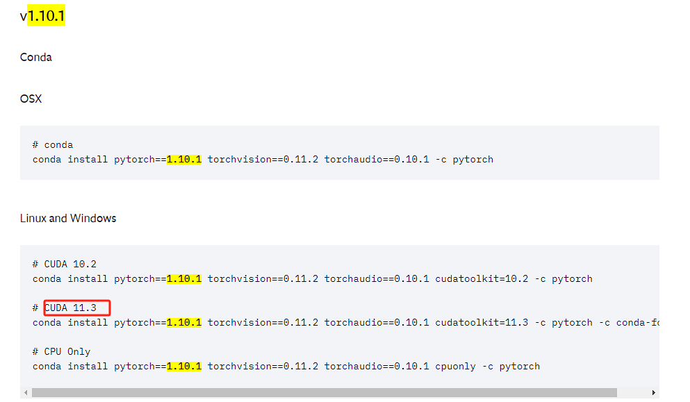
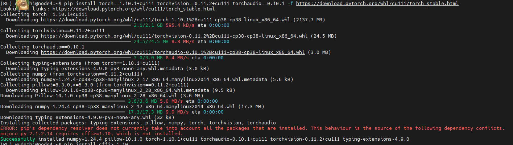
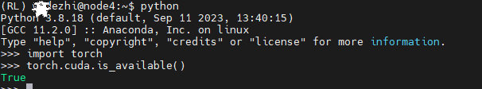

# Linux上Anaconda和Pytorch-GPU环境配置

> **如果这篇教程对你有用，请花2秒钟帮我的仓库点颗星，这将激励我写更多对大家有用的博客**

##  Anaconda安装

Anaconda的部署比较简单，几行命令就能解决。

### 首先，通过在终端中运行以下命令，确保所有系统包都是最新的。

```python
sudo apt update
sudo apt upgrade
sudo apt install wget apt-transport-https gnupg2 software-properties-common
```

### 然后，通过命令下载Anaconda

```python	
wget https://repo.anaconda.com/archive/Anaconda3-2022.05-Linux-x86_64.sh
```

### 下载 Anaconda 安装程序后，现在使用以下命令运行脚本：

```python
bash Anaconda3-2022.05-Linux-x86_64.sh
```


### 按照向导说明完成 Anaconda 安装过程。
```xml
Welcome to Anaconda3 2022.05

In order to continue the installation process, please review the license
agreement.

Please, press ENTER to continue

>>>
```

### 安装 Anaconda 后，下一步是通过运行以下命令来使用“ ”文件中添加的环境设置：.bashrc
```xml
source .\bashrc
```

### 验证 Anaconda 安装：
```python
conda list
```

### 最后，如果你想更新你必须运行的整个环境：
```xml
conda update –-all
```


## 安装Pytorch-GPU版本的

### 新建Pytorch虚拟环境
```xml
conda create -n RL python=3.8 # RL可以替换成你想要的名字
```

### 激活Pytorch虚拟环境

```xml
conda activate RL
```

### 查询CUDA版本

```xml
nvidia-smi
```



可以看到我的CUDA是12.0版本，因此我安装时CUDA版本要小于12.0，才能兼容。

### 安装pytorch

官方网址：https://pytorch.org/get-started/previous-versions/

```xml
pip install torch==1.10.1+cu111 torchvision==0.11.2+cu111 torchaudio==0.10.1 -f https://download.pytorch.org/whl/cu111/torch_stable.html
```




我选择用pip进行安装，同学们如果怕网速太慢，也可以选择用conda进行安装，这里无特定要求。






### 测试是否为GPU版本

在终端依次输入下面代码：

```xml
python
import torch
torch.cuda.is_available()
```



True ,则为成功否则就是失败了。

失败后请看第三节。

## 下载了CPU版本的pytorch如何换成GPU版本

此时要分为两种情况，你这个环境是否安装了很多其他的包？

若是，则卸载pytorch，重新安装。

若不是，则删除该环境，重新建一个环境。

详细步骤请同学们往下看。

### 第一种情况：下载了很多其他的包

1. 查看已有的pytorch用什么安装的

   ```
   conda list
   或
   pip list
   ```

   确认现在pytorch是用什么安装的，用哪个安装的就要用哪个卸载。

2. 卸载pytorch

   - 若用conda安装

   ```xml
   conda uninstall pytorch
   ```

   - 若有pip安装

   ```xml
   pip uninstall pytorch
   ```

3. 重新下载

​	请同学移步到上面的教程。

### 第二种情况：重建一个环境，重新下载

1. ​	退出当前环境

```xml
conda deactivate
```

2. 请同学移步到上面第二步教程

## 参考博客:

1. Anaconda 安装：https://dashen.wang/880.html
2. pytorch卸载：https://zhuanlan.zhihu.com/p/374198858
